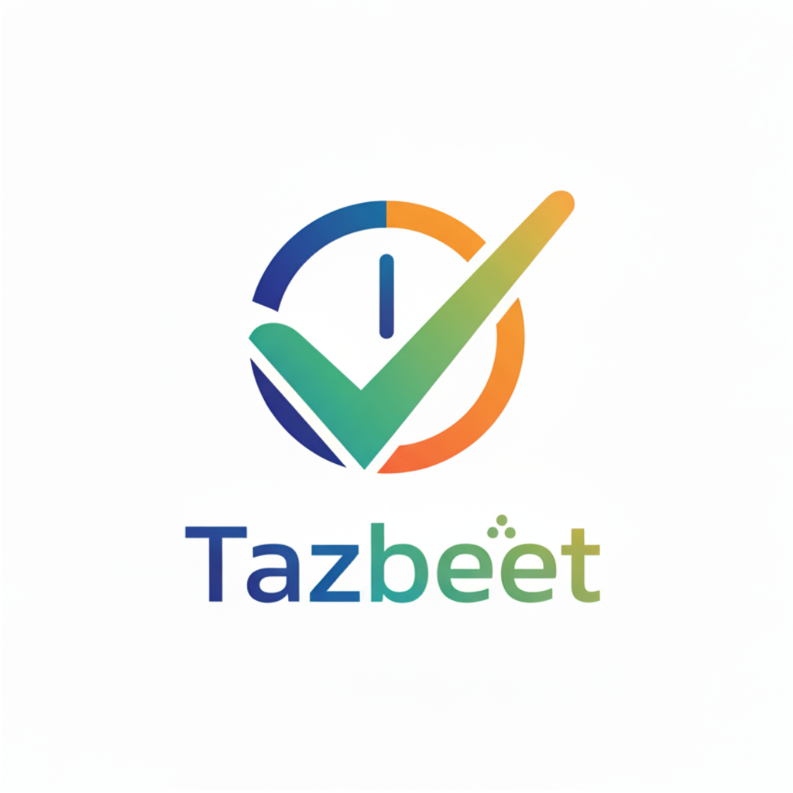

# تظبيت - Tazbeet 📋

<div align="center">



**تطبيق شامل لإدارة المهام والإنتاجية**

[](https://flutter.dev/)
[](https://dart.dev/)
[](https://firebase.google.com/)
[]()

[العربية](#arabic) | [English](#english)

</div>

---

## <a name="arabic"></a>🇸🇦 النسخة العربية

### 📱 نظرة عامة

**تظبيت** هو تطبيق متكامل لإدارة المهام والإنتاجية مصمم خصيصاً للمستخدمين العرب. يجمع التطبيق بين إدارة المهام الذكية، تتبع الحالة المزاجية، تقنية بومودورو، والتذكيرات الذكية في تطبيق واحد سهل الاستخدام.

### ✨ المميزات الرئيسية

#### 📋 إدارة المهام المتقدمة

- ✅ إنشاء وتنظيم المهام بسهولة
- 🏷️ تصنيف المهام حسب الفئات مع ألوان مخصصة
- 📅 تقويم تفاعلي لعرض المهام
- 🔔 تذكيرات ذكية قابلة للتخصيص
- 🔄 مهام متكررة (يومية، أسبوعية، شهرية)
- ⭐ أولويات المهام (عالية، متوسطة، منخفضة)
- 📊 تتبع التقدم والإحصائيات

#### 🎯 تقنية بومودورو

- ⏱️ مؤقت بومودورو احترافي
- ⚙️ إعدادات قابلة للتخصيص
- 📈 تتبع الجلسات المكتملة
- 🔊 أصوات محيطة للتركيز (مطر، غابة، بحر، ضوضاء بيضاء)

#### 😊 تتبع الحالة المزاجية

- 📝 تسجيل الحالة المزاجية اليومية
- 📊 رسوم بيانية لتتبع المزاج
- 🔔 تذكيرات لتسجيل المزاج
- 📈 تحليل الأنماط المزاجية

#### 🔔 نظام إشعارات متقدم

- 📱 إشعارات محلية ذكية
- ⏰ جدولة دقيقة للتذكيرات
- 🎨 إشعارات مخصصة لكل نوع مهمة
- 📊 تتبع أداء الإشعارات

#### 🎨 تجربة مستخدم متميزة

- 🌓 وضع داكن وفاتح
- 🌍 دعم كامل للغة العربية والإنجليزية
- 🎭 رسوم متحركة سلسة
- 📱 تصميم متجاوب لجميع الأحجام
- ♿ دعم إمكانية الوصول

#### ☁️ المزامنة والنسخ الاحتياطي

- 🔄 مزامنة تلقائية عبر Firebase
- 💾 نسخ احتياطي آمن للبيانات
- 🔐 مصادقة آمنة (Google Sign-In)
- 📤 تصدير البيانات بصيغة CSV

### 🛠️ التقنيات المستخدمة

- **Framework**: Flutter 3.8.1
- **Language**: Dart 3.8.1
- **State Management**: BLoC Pattern
- **Backend**: Firebase (Firestore, Auth, Storage, Crashlytics)
- **Local Storage**: Hive, Shared Preferences
- **Notifications**: Flutter Local Notifications, WorkManager
- **UI Libraries**: Material 3, Syncfusion Calendar, FL Chart
- **Animations**: Flutter Animate, Lottie

### 📦 البنية المعمارية

```
lib/
├── blocs/          # إدارة الحالة (BLoC)
├── models/         # نماذج البيانات
├── repositories/   # طبقة الوصول للبيانات
├── services/       # الخدمات (Firebase, Notifications, etc.)
├── ui/
│   ├── screens/    # شاشات التطبيق
│   ├── widgets/    # مكونات قابلة لإعادة الاستخدام
│   ├── themes/     # السمات والألوان
│   └── controllers/# وحدات التحكم
├── utils/          # أدوات مساعدة
└── l10n/           # ملفات الترجمة
```

### 🚀 البدء

#### المتطلبات

- Flutter SDK 3.8.1 أو أحدث
- Dart SDK 3.8.1 أو أحدث
- Android Studio / VS Code
- حساب Firebase

#### التثبيت

1. **استنساخ المشروع**

```bash
git clone https://github.com/yourusername/tazbeet.git
cd tazbeet
```

2. **تثبيت التبعيات**

```bash
flutter pub get
```

3. **إعداد Firebase**

- أضف ملف `google-services.json` في `android/app/`
- أضف ملف `GoogleService-Info.plist` في `ios/Runner/`

4. **تشغيل التطبيق**

```bash
flutter run
```

### 🏗️ البناء للإصدار

#### Android (APK)

```bash
flutter build apk --release
```

#### Android (App Bundle)

```bash
flutter build appbundle --release
```

#### iOS

```bash
flutter build ios --release
```

### 📊 الإحصائيات

- **الإصدار الحالي**: 1.0.6+6
- **عدد الشاشات**: 26+
- **عدد المكونات**: 32+
- **الدعم اللغوي**: 4 لغات (العربية، الإنجليزية، الفرنسية، الإسبانية)
- **عدد الاختبارات**: 13+ unit tests

### 🧪 الاختبار

```bash
# تشغيل جميع الاختبارات
flutter test

# تشغيل اختبارات محددة
flutter test test/home_screen_controller_test.dart

# تحليل الكود
flutter analyze
```

### 📝 المساهمة

نرحب بالمساهمات! يرجى اتباع الخطوات التالية:

1. Fork المشروع
2. إنشاء فرع جديد (`git checkout -b feature/AmazingFeature`)
3. Commit التغييرات (`git commit -m 'Add some AmazingFeature'`)
4. Push للفرع (`git push origin feature/AmazingFeature`)
5. فتح Pull Request

### 📄 الترخيص

هذا المشروع محمي بحقوق الملكية. جميع الحقوق محفوظة.

### 📞 التواصل

- **البريد الإلكتروني**: support@tazbeet.com
- **الموقع**: https://tazbeet.com
- **سياسة الخصوصية**: https://tazbeet.com/privacy

### 🙏 شكر وتقدير

- فريق Flutter
- مجتمع Firebase
- جميع المساهمين في المكتبات مفتوحة المصدر المستخدمة

---

## <a name="english"></a>🇬🇧 English Version

### 📱 Overview

**Tazbeet** is a comprehensive task management and productivity app designed specifically for Arabic users. The app combines smart task management, mood tracking, Pomodoro technique, and intelligent reminders in one easy-to-use application.

### ✨ Key Features

- 📋 **Advanced Task Management**: Create, organize, and track tasks with categories, priorities, and due dates
- 📅 **Interactive Calendar**: Visual calendar view with drag-and-drop task rescheduling
- 🎯 **Pomodoro Timer**: Professional timer with customizable settings and ambient sounds
- 😊 **Mood Tracking**: Daily mood logging with analytics and insights
- 🔔 **Smart Notifications**: Customizable reminders with advanced scheduling
- 🌓 **Dark/Light Mode**: Beautiful themes for comfortable viewing
- 🌍 **Multi-language**: Full support for Arabic, English, French, and Spanish
- ☁️ **Cloud Sync**: Automatic synchronization via Firebase
- 📊 **Progress Tracking**: Detailed statistics and charts
- 📤 **Data Export**: Export your data to CSV

### 🛠️ Tech Stack

- **Framework**: Flutter 3.8.1
- **State Management**: BLoC Pattern
- **Backend**: Firebase (Firestore, Auth, Storage, Crashlytics)
- **UI**: Material 3, Syncfusion, FL Chart
- **Animations**: Flutter Animate, Lottie

### 🚀 Getting Started

```bash
# Clone the repository
git clone https://github.com/yourusername/tazbeet.git

# Install dependencies
flutter pub get

# Run the app
flutter run
```

### 📊 Statistics

- **Current Version**: 1.0.6+6
- **Screens**: 26+
- **Widgets**: 32+
- **Languages**: 4 (Arabic, English, French, Spanish)
- **Tests**: 13+ unit tests

### 📄 License

This project is proprietary. All rights reserved.

### 📞 Contact

- **Email**: support@tazbeet.com
- **Website**: https://tazbeet.com

---

<div align="center">

**Made with ❤️ for productivity enthusiasts**

</div>
